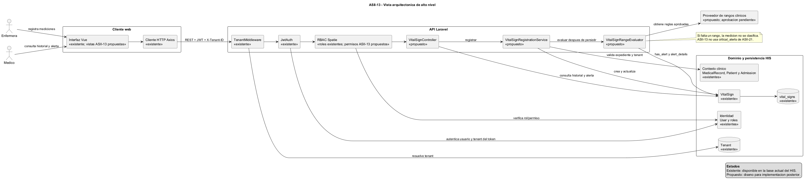

# ASII-13: Vista arquitectonica del modulo

## 1. Datos del modulo

| Campo | Informacion |
| --- | --- |
| **Codigo del modulo** | ASII-13 |
| **Nombre del modulo** | Signos vitales y alertas por valores anormales |
| **Responsable** | Josue Fernando Hicho Garcia |
| **Sistema** | Sistema Hospitalario Integrado |
| **Semana** | 3: Diseno arquitectonico, vistas y patrones |
| **Antecedentes** | `semana-01-actores-alcance-y-casos-de-uso.md` y `semana-02-rf-rnf-criterios-aceptacion-solid.md` |

## 2. Objetivo de la vista

Esta vista describe los componentes de alto nivel que intervienen en ASII-13 y sus dependencias con el Sistema Hospitalario Integrado (HIS). El diseno conserva los cuatro casos de uso definidos en la Semana 1 y la separacion de responsabilidades propuesta por SRP en la Semana 2.

El diagrama se mantiene en formato PlantUML editable en [diagramas/arquitectura-asii-13.puml](diagramas/arquitectura-asii-13.puml). Los componentes marcados como **existentes** ya forman parte de la base del HIS; los marcados como **propuestos** describen la arquitectura que se implementara en etapas posteriores. Esta entrega no agrega rutas, controladores, servicios, migraciones, reglas clinicas ni interfaz funcional.

## 3. Alcance arquitectonico

ASII-13 recibe mediciones clinicas de personal autorizado, las asocia al expediente medico y tenant correspondiente, persiste el registro `VitalSign`, evalua las mediciones que tengan rangos aprobados y expone el historial con el detalle de una condicion anormal cuando corresponda.

El modulo no administra datos demograficos del paciente (ASII-03), el expediente medico completo (ASII-10) ni alertas criticas de laboratorio (ASII-21). La condicion anormal de ASII-13 se conserva en `VitalSign.has_alert` y `VitalSign.alert_details`; no utiliza `critical_alerts`.

## 4. Componentes y responsabilidades

| Componente | Estado | Responsabilidad |
| --- | --- | --- |
| Interfaz web Vue | Base existente; vista ASII-13 propuesta | Presentar formulario de registro, historial e indicador/detalle de alerta segun el rol del usuario. |
| Cliente HTTP Axios | Existente | Enviar JWT y `X-Tenant-ID` a la API. |
| API Laravel | Existente; endpoints ASII-13 propuestos | Exponer el contrato REST del modulo. Sus endpoints y payloads se definiran formalmente en Semana 5. |
| `TenantMiddleware` | Existente | Exigir, resolver y fijar el tenant de la solicitud mediante `X-Tenant-ID`. |
| `JwtAuth` | Existente | Autenticar el JWT y rechazar un tenant que no coincida con el usuario del token. |
| RBAC con Spatie | Base existente; permisos ASII-13 propuestos | Aplicar permisos diferenciados para registrar, consultar historial y consultar alertas. Actualmente existen roles, pero los permisos especificos del modulo deben definirse antes de implementarlo. |
| `VitalSignController` | Propuesto | Coordinar la peticion HTTP, autorizacion, validacion y respuesta, sin contener reglas clinicas. |
| `VitalSignRegistrationService` | Propuesto | Verificar el expediente en el tenant, crear el `VitalSign` y solicitar su evaluacion dentro de una operacion consistente. |
| `VitalSignRangeEvaluator` | Propuesto | Comparar solo mediciones disponibles contra rangos configurados y devolver la clasificacion explicable. |
| Proveedor de rangos clinicos | Decision pendiente | Proveer unicamente rangos clinicos aprobados. Si un rango falta, la medicion queda sin clasificar; no se asume normal ni anormal. |
| `VitalSign` y `vital_signs` | Existentes | Persistir mediciones, trazabilidad, indicador `has_alert` y detalle `alert_details`. |
| Expediente, paciente, admision y usuario | Existentes | Proveer el contexto clinico, relacion del paciente, admision opcional y usuario que registro la medicion. |

## 5. Flujos arquitectonicos principales

### 5.1 Registro y evaluacion automatica

1. La enfermera usa la interfaz web para registrar una o mas mediciones.
2. Axios envia la solicitud con `Authorization: Bearer <JWT>` y `X-Tenant-ID`.
3. `TenantMiddleware` resuelve el tenant y `JwtAuth` valida el token y su coincidencia con el tenant solicitado.
4. El controlador propuesto verifica el permiso de registro y delega al servicio de registro.
5. El servicio valida que el expediente medico pertenezca al tenant, conserva `registered_by` desde el usuario autenticado y crea `VitalSign`.
6. El evaluador consulta los rangos clinicos configurados para las mediciones disponibles.
7. Si una medicion evaluable esta fuera de rango, el servicio actualiza `has_alert` y `alert_details`; si falta una regla, no clasifica esa medicion como normal ni anormal.
8. La API devuelve el registro y el estado de su evaluacion sin crear alertas de laboratorio.

### 5.2 Historial y consulta de alerta

1. El medico solicita el historial de un paciente desde la interfaz.
2. Los mismos middleware y permisos validan identidad, tenant y autorizacion.
3. El controlador consulta exclusivamente `VitalSign` del expediente/paciente dentro del tenant activo, ordenado por `measured_at` descendente.
4. La interfaz muestra las mediciones, fecha, usuario responsable e indicador de alerta.
5. Para un registro con `has_alert = true`, el medico autorizado consulta `alert_details` del mismo `VitalSign`.

## 6. Decisiones arquitectonicas

| Decision | Justificacion | Consecuencia |
| --- | --- | --- |
| Separar controlador, servicio y evaluador | Aplica SRP definido en Semana 2: contrato HTTP, persistencia y criterio clinico cambian por razones distintas. | El evaluador se puede probar de forma aislada y los rangos no quedan acoplados al controlador. |
| Usar `VitalSign` existente | Semana 1 establece que no se debe crear una entidad paralela. | Se conservan las relaciones, indices y campos de alerta ya disponibles. |
| Aislar todas las operaciones por tenant | RF-13-07 y RNF-13-01 exigen que no se expongan datos clinicos entre tenants. | El tenant se resuelve antes de consultar o crear informacion clinica y se verifica contra JWT. |
| Mantener alertas en el registro de signos vitales | Semana 2 diferencia ASII-13 de ASII-21. | `has_alert` y `alert_details` son la fuente del indicador y detalle de alerta del modulo. |
| No codificar rangos clinicos sin aprobacion | RF-13-04 y RNF-13-06 prohiben inferir reglas inexistentes. | Debe acordarse la fuente, versionado y aprobacion de rangos antes de implementar el evaluador. |

## 7. Dependencias y limites con el HIS

| Dependencia | Uso de ASII-13 | Limite de responsabilidad |
| --- | --- | --- |
| ASII-03 / `Patient` | Identificar al paciente mediante su expediente. | No crear ni editar datos demograficos. |
| ASII-10 / `MedicalRecord` | Asociar y consultar signos vitales clinicos. | No administrar el expediente completo. |
| `Admission` | Vincular una admision cuando exista. | No gestionar ingresos, camas ni altas. |
| Autenticacion JWT y tenant | Identificar usuario y aislar informacion clinica. | No reemplazar la autenticacion central del HIS. |
| RBAC | Restringir las acciones de enfermera, medico y administrador. | Definir los permisos concretos antes de la implementacion. |
| ASII-21 | Mantener separadas las alertas criticas de laboratorio. | No crear ni consultar `critical_alerts` como alerta de signos vitales. |

## 8. Trazabilidad con semanas anteriores

| Elemento previo | Componente o decision arquitectonica |
| --- | --- |
| `CU-01` Registrar signos vitales | Interfaz Vue, API Laravel, middleware, controlador, servicio, `VitalSign` y evaluador. |
| `CU-02` Consultar historial | Interfaz Vue, API Laravel, middleware, RBAC y consulta tenant-scoped de `VitalSign`. |
| `CU-03` Detectar valor anormal | `VitalSignRegistrationService`, `VitalSignRangeEvaluator`, proveedor de rangos y campos de alerta. |
| `CU-04` Mostrar alerta vinculada | Historial, `has_alert`, `alert_details` y permiso de consulta de alerta. |
| `RF-13-01` a `RF-13-03` | Registro, validacion, trazabilidad y consulta delimitada por tenant. |
| `RF-13-04` a `RF-13-06` | Evaluador independiente, fuente de rangos y alerta dentro de `VitalSign`. |
| `RF-13-07`, `RNF-13-01` y `RNF-13-02` | JWT, `X-Tenant-ID` y RBAC. |
| `RNF-13-05` y `RNF-13-06` | Separacion SRP y ausencia de clasificacion ante rangos no configurados. |

## 9. Entregable de Semana 3

| Criterio | Evidencia | Estado |
| --- | --- | --- |
| Vista arquitectonica de alto nivel | Diagrama PlantUML editable y PNG en `diagramas/`. | Completado |
| Dependencias con el HIS | Secciones 4 y 7. | Completado |
| Patrones y responsabilidades | Separacion controlador, servicio y evaluador en secciones 4 y 6. | Completado |
| Coherencia con Semana 1 y 2 | Trazabilidad en seccion 8. | Completado |
| Implementacion funcional | Fuera de alcance de Semana 3. | No aplica |

## 10. Proximos pasos

La Semana 4 debera profundizar esta vista con una arquitectura por capas y responsabilidades detalladas para UI, API, logica de negocio, persistencia y objetos reutilizables. La Semana 5 definira el contrato REST, payloads, errores y permisos concretos de ASII-13.
